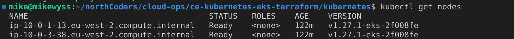
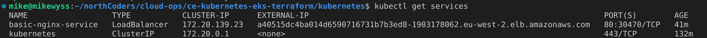

### Share a screenshot of the output of `kubectl get nodes` once you have connected to your cluster

### What version of Kubernetes does this repository provision?

> 1.27

### Explain what you understand about EKS Node Groups

> Node groups are essentially AWS auto-scaling groups that automatically provision the desired amount of nodes, and keep a specified number of nodes live by provisioning a new one anytime one failes.

### The cluster setup includes an add-on called 'coredns' - what does this do?

> This enables the feature where kubernetes will create a private DNS for each node that can be accessed within the cluster.

### Once you have deployed and configured NGiNX, show the output of the `kubectl get services` command

